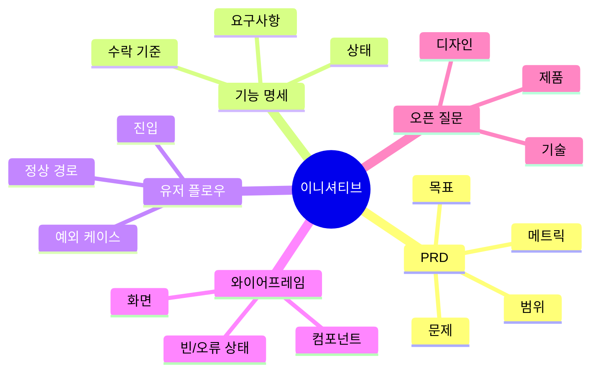

# 기획 패키지 레퍼런스

`feature-spec.md`, `user-flow.md`, `wireframe.md`, `diagram.md`, `preview.html`을 작성할 때 이 레퍼런스를 사용합니다.

근거 기반: 이 레퍼런스의 산출물 체인은 PRD, 기능명세서, 유저플로우, 와이어프레임 각각 10개 이상의 출처를 검토한 로컬 조사 보고서 [`../../../.hypercore/research/002-prd-package-layered-artifacts.md`](../../../.hypercore/research/002-prd-package-layered-artifacts.md)에 기반합니다.

## 패키지 원칙

패키지는 AI 기획 도우미가 러프한 아이디어에서 1차 초안을 완성한 느낌이어야 하지만, 검토 지점은 분명해야 합니다. 각 문서는 단독으로도 유용하고 서로 일관되어야 하지만, 병렬로 쓰는 동등 문서가 아닙니다. 의존 체인은 다음입니다.

```text
PRD → 기능명세서 → 유저플로우 → 저충실도 와이어프레임 → 다이어그램/미리보기 wrapper
```

다이어그램은 패키지를 가장 빠르게 훑는 개요가 되어야 하고, 미리보기는 전체 패키지를 브라우저에서 쉽게 검토하게 해야 합니다.

## 산출물 인수인계 계약

| 산출물 | 주 역할 | 반드시 상속할 것 | 후속 산출물에 노출할 것 |
|---|---|---|---|
| `prd.md` | 제품 문제, 범위, 목표, 메트릭, 리스크, 요구사항 결정 | 사용자 맥락 + 근거 | 요구사항 ID, 성공 기준, 제약, 오픈 질문 |
| `feature-spec.md` | 제품 요구사항을 구현 가능한 동작으로 번역 | PRD 요구사항 ID | 기능 ID, 트리거, 상태, 권한, 오류, 수락 기준 |
| `user-flow.md` | 액터가 목표를 완료하는 경로 검증 | 기능 ID와 사용자-facing 동작 | 진입점, 결정, 정상/대안/오류 경로, 화면 상태 필요사항 |
| `wireframe.md` | 시각 디자인 전 저충실도 화면 구조 설명 | 유저플로우 단계와 상태 | 화면 ID, 레이아웃 블록, 컴포넌트, 상태 변형, 주석 |
| `diagram.md` / `preview.html` | 패키지를 빠르게 훑고 검토 가능하게 함 | 모든 패키지 문서 | 최신 패키지 상태의 맵과 브라우저 뷰 |

후속 산출물이 누락된 상위 결정을 드러내면 상위 파일을 갱신하거나 그곳에 보이는 오픈 질문을 추가합니다.

## `feature-spec.md`

목적: 제품 의도를 구현 가능한 동작으로 번역하되, 꼭 필요한 경우가 아니면 구현 방식을 지시하지 않습니다.

권장 섹션:

- 요약과 원본 PRD 링크
- PRD 요구사항 ID가 포함된 기능 목록
- 기능 요구사항 표
- 수락 기준
- 상태와 전이
- 권한과 역할
- 데이터, 콘텐츠, 설정 요구
- 빈, 로딩, 오류, 예외 상태
- 알림 또는 메시징
- 분석 이벤트와 성공 이벤트
- 출시, 마이그레이션, 운영 메모
- 오픈 질문

요구사항 행 형태:

| ID | PRD IDs | 기능 동작 | 트리거 | 사용자/시스템 응답 | 수락 기준 | 메모 |
|----|---------|-----------|--------|---------------------|-----------|------|

기능명세서 규칙:

- 동작은 관찰 가능하고 테스트 가능하게 유지합니다.
- 상태에 따라 동작이 달라지면 최소 상태 모델을 포함합니다.
- 기능이 사용자 행동, 데이터, 측정에 영향을 주면 권한, 오류, 분석을 포함합니다.
- 제약이 제품 요구사항의 일부가 아니라면 구현 세부를 지시하지 않습니다.

## `user-flow.md`

목적: 액터가 제품 안에서 어떻게 이동하고 어디서 결정 또는 실패가 일어나는지 보여줍니다.

권장 섹션:

- 액터와 진입점
- 플로우 개요
- 정상 경로
- 대안 경로
- 예외와 오류 경로
- 빈 상태
- 권한 또는 차단 상태
- 종료 지점과 성공 상태
- 플로우-화면 매핑
- 오픈 질문

번호 단계와 결정 라벨을 사용합니다. 다이어그램 문법은 선택 사항이며 읽기 쉬운 텍스트면 충분합니다.

유저플로우 규칙:

- 가능하면 한 번에 하나의 사용자 목표 또는 작업을 매핑합니다.
- 각 플로우는 명시적 진입점에서 시작합니다.
- 결정 지점은 질문형으로 쓰고 분기 라벨을 명확히 합니다.
- 중요한 오류는 실패에서 끝내지 말고 복구 경로를 포함합니다.
- 필수 동작이면 플로우 단계를 기능 요구사항 ID와 연결합니다.

## `wireframe.md`

목적: 시각 디자인 전에 저충실도 구조를 설명합니다.

권장 섹션:

- 화면 목록
- 공통 레이아웃 메모
- 화면별 와이어프레임
- 컴포넌트 목록
- 반응형 또는 플랫폼 메모
- 콘텐츠 placeholder와 빈 상태
- 인터랙션 메모와 주석
- 미해결 디자인/제품 질문

텍스트 와이어프레임 패턴:

```text
[화면 ID] [화면 이름]
목적: ...
관련 플로우 단계: ...
레이아웃:
- 헤더: ...
- 주요 콘텐츠: ...
- 보조 콘텐츠: ...
- 액션: ...
상태:
- 기본: ...
- 빈 상태: ...
- 로딩: ...
- 오류: ...
- 성공: ...
주석:
1. ...
```

와이어프레임 규칙:

- 구조, 계층, 액션, 상태, 주석 중심의 저충실도를 유지하고 최종 시각 디자인을 만들지 않습니다.
- 의미가 사용성에 영향을 주는 곳은 현실적인 라벨을 사용합니다.
- 사용자-facing 화면에는 특히 빈, 로딩, 오류, 성공, 비활성, 권한 상태 같은 상태 변형을 포함합니다.
- 각 사용자-facing 플로우 단계는 화면 또는 상태 항목과 연결합니다.

## `diagram.md`

목적: 가지형 AI 기획 캔버스처럼 보이는 시각 기획 맵을 만듭니다. 검토자가 모든 텍스트 산출물을 읽기 전에 제품 분해 구조를 이해할 수 있어야 합니다.

권장 섹션:

- 다이어그램 요약과 패키지 링크
- Mermaid `mindmap` 또는 `flowchart` 원본
- 노드 목록 표
- PRD, 기능 명세, 유저 플로우, 와이어프레임, 오픈 질문 가지 메모
- 결정적 렌더링을 위한 `diagram.data.json` 노드 데이터
- 렌더 메모: `scripts/render-planning-map.mjs`로 `diagram.svg`를 만듭니다

권장 형태:



노드 라벨은 훑기 좋게 짧게 유지합니다. 긴 설명은 노드 안이 아니라 다이어그램 아래에 둡니다. `diagram.data.json`과 Mermaid 블록은 서로 맞춰 둡니다.

## `preview.html`

목적: 패키지를 로컬 브라우저에서 볼 수 있는 뷰어를 제공합니다. `assets/preview.template.html`에서 `scripts/build-preview.mjs`로 생성하며, 사용자가 명시하지 않는 한 생성된 preview를 직접 고치지 않습니다.

미리보기 규칙:

- `file://`에서도 fetch 없이 볼 수 있도록 패키지 마크다운과 `diagram.svg`를 빌드 시점에 임베드합니다.
- PRD, 기능 명세, 유저 플로우, 와이어프레임, 다이어그램, 출처, flow 상태가 바뀌면 다시 생성합니다.
- 미리보기는 읽기 전용 검토용이며 source of truth가 아닙니다.
- 패키지 마크다운 파일과 JSON 데이터가 canonical source입니다.

## 정렬 규칙

- 가능하면 PRD와 기능 명세에서 같은 요구사항 ID를 사용합니다.
- 필수 동작이면 유저 플로우 단계와 기능 요구사항 ID를 연결합니다.
- 사용자-facing 화면이면 와이어프레임 화면과 플로우 단계를 연결합니다.
- 큰 수정 후에는 다이어그램과 미리보기도 패키지 문서와 동기화합니다.
- 영향을 받는 각 파일에 미해결 질문을 남기되, canonical 목록은 `prd.md`에서 보이게 합니다.
