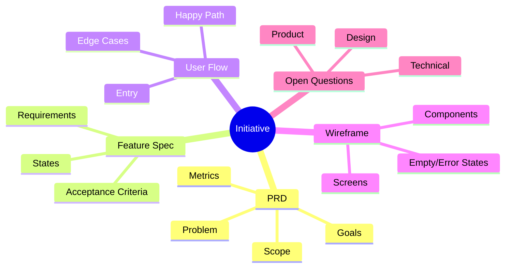

# Planning Package Reference

Use this reference when drafting `diagram.md`, `feature-spec.md`, `user-flow.md`, `wireframe.md`, or `preview.html`.

## Package principle

The package should feel like an AI planning assistant completed the first pass from a rough idea, while still making review points obvious. Every document should be useful alone and consistent with the others. The diagram should provide the fastest overview of the package, and the preview should make the whole package easy to review in a browser.

## `diagram.md`

Purpose: create a visual planning map similar to a branching AI planning canvas. It should help reviewers understand the product decomposition before reading every text artifact.

Recommended sections:

- Diagram summary and package links
- Mermaid `mindmap` or `flowchart` source
- Node inventory table
- Branch notes for PRD, feature spec, user flow, wireframe, and open questions
- `diagram.data.json` node data for deterministic rendering
- Render notes: create `diagram.svg` with `scripts/render-planning-map.mjs`

Preferred shape:



Keep node labels short enough to scan. Put longer explanation below the diagram, not inside nodes. Keep `diagram.data.json` and the Mermaid block aligned.

## `preview.html`

Purpose: provide a local browser viewer for the package. It is generated from `assets/preview.template.html` by `scripts/build-preview.mjs`; do not hand-edit generated previews unless the user explicitly asks.

Preview rules:

- Embed package markdown and `diagram.svg` at build time so `file://` viewing works without fetch calls.
- Rebuild after changing PRD, diagram, feature spec, user flow, wireframe, sources, or flow state.
- Keep the preview read-only and review-oriented; it is not the source of truth.
- Use `diagram.md`, markdown files, and JSON data as canonical sources.

## `feature-spec.md`

Purpose: translate product intent into buildable behavior without prescribing implementation unless required.

Recommended sections:

- Summary and source PRD link
- Feature inventory
- Functional requirements table
- Acceptance criteria
- States and transitions
- Permissions and roles
- Data, content, and configuration needs
- Empty, loading, error, and edge states
- Notifications or messaging
- Analytics and success events
- Rollout, migration, and operational notes
- Open questions

Requirement row shape:

| ID | Feature behavior | Trigger | User/system response | Acceptance criteria | Notes |
|----|------------------|---------|----------------------|---------------------|-------|

## `user-flow.md`

Purpose: show how actors move through the product and where decisions or failures happen.

Recommended sections:

- Actors and entry points
- Flow overview
- Happy path
- Alternate paths
- Edge and error paths
- Empty states
- Permissions or blocked states
- Exit points and success states
- Flow-to-screen map
- Open questions

Use numbered steps and decision labels. Keep diagram syntax optional; readable text is enough.

## `wireframe.md`

Purpose: describe low-fidelity structure before visual design.

Recommended sections:

- Screen inventory
- Global layout notes
- Screen-by-screen wireframes
- Component inventory
- Responsive or platform notes
- Content placeholders and empty states
- Interaction notes
- Unresolved design/product questions

Text wireframe pattern:

```text
[Screen name]
Purpose: ...
Layout:
- Header: ...
- Primary content: ...
- Secondary content: ...
- Actions: ...
States:
- Empty: ...
- Error: ...
- Loading: ...
```

## Alignment rules

- Keep the diagram and preview synchronized with package docs after significant edits.
- Use the same requirement IDs across PRD and feature spec where possible.
- Link user-flow steps to feature requirement IDs when a behavior is required.
- Link wireframe screens to flow steps when the screen is user-facing.
- Keep unresolved questions in each affected file, but make the canonical list visible in `prd.md`.
