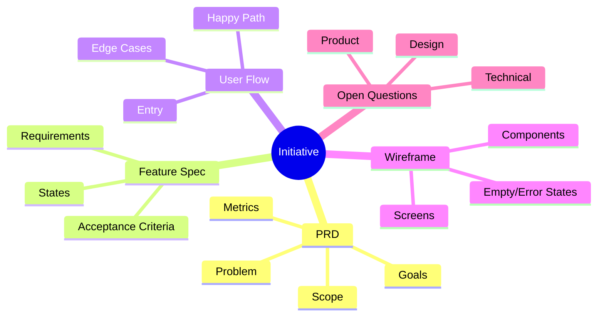

# Planning Package Reference

Use this reference when drafting `feature-spec.md`, `user-flow.md`, `wireframe.md`, `diagram.md`, or `preview.html`.

Evidence basis: the artifact chain in this reference is grounded in the local research report [`../../../.hypercore/research/002-prd-package-layered-artifacts.md`](../../../.hypercore/research/002-prd-package-layered-artifacts.md), which reviewed 10+ sources each for PRDs, feature specifications, user flows, and wireframes.

## Package principle

The package should feel like an AI planning assistant completed the first pass from a rough idea, while still making review points obvious. Every document should be useful alone and consistent with the others, but they are not peers written in parallel. The dependency chain is:

```text
PRD → feature specification → user flow → low-fidelity wireframe → diagram/preview wrappers
```

The diagram should provide the fastest overview of the package, and the preview should make the whole package easy to review in a browser.

## Artifact handoff contract

| Artifact | Primary job | Must inherit from | Must expose downstream |
|---|---|---|---|
| `prd.md` | Decide product problem, scope, goals, metrics, risks, and requirements | user context + evidence | requirement IDs, success criteria, constraints, open questions |
| `feature-spec.md` | Translate product requirements into buildable behavior | PRD requirement IDs | feature IDs, triggers, states, permissions, errors, acceptance criteria |
| `user-flow.md` | Validate how actors complete goals through the behavior | feature IDs and user-facing behaviors | entry points, decisions, happy/alternate/error paths, screen-state needs |
| `wireframe.md` | Describe low-fidelity screen structure before visual design | user-flow steps and states | screen IDs, layout blocks, components, state variants, annotations |
| `diagram.md` / `preview.html` | Make the package easy to scan and review | all package docs | map and browser view of the latest package state |

If a downstream artifact reveals a missing upstream decision, update the upstream file or add a visible open question there.

## `feature-spec.md`

Purpose: translate product intent into buildable behavior without prescribing implementation unless required.

Recommended sections:

- Summary and source PRD link
- Feature inventory with PRD requirement IDs
- Functional requirements table
- Acceptance criteria
- States and transitions
- Permissions and roles
- Data, content, and configuration needs
- Empty, loading, error, and edge states
- Notifications or messaging
- Analytics and success events
- Rollout, migration, and operational notes
- Open questions

Requirement row shape:

| ID | PRD IDs | Feature behavior | Trigger | User/system response | Acceptance criteria | Notes |
|----|---------|------------------|---------|----------------------|---------------------|-------|

Feature-spec rules:

- Keep behavior observable and testable.
- Include the minimum state model when behavior changes by state.
- Include permissions, errors, and analytics when the feature affects user action, data, or measurement.
- Avoid dictating implementation details unless the constraint is part of the product requirement.

## `user-flow.md`

Purpose: show how actors move through the product and where decisions or failures happen.

Recommended sections:

- Actors and entry points
- Flow overview
- Happy path
- Alternate paths
- Edge and error paths
- Empty states
- Permissions or blocked states
- Exit points and success states
- Flow-to-screen map
- Open questions

Use numbered steps and decision labels. Keep diagram syntax optional; readable text is enough.

User-flow rules:

- Map one user goal or task at a time when possible.
- Start each flow from an explicit entry point.
- Write decision points as questions and label branches clearly.
- Include recovery paths for critical errors rather than ending at failure.
- Link flow steps to feature requirement IDs when behavior is required.

## `wireframe.md`

Purpose: describe low-fidelity structure before visual design.

Recommended sections:

- Screen inventory
- Global layout notes
- Screen-by-screen wireframes
- Component inventory
- Responsive or platform notes
- Content placeholders and empty states
- Interaction notes and annotations
- Unresolved design/product questions

Text wireframe pattern:

```text
[Screen ID] [Screen name]
Purpose: ...
Related flow steps: ...
Layout:
- Header: ...
- Primary content: ...
- Secondary content: ...
- Actions: ...
States:
- Default: ...
- Empty: ...
- Loading: ...
- Error: ...
- Success: ...
Annotations:
1. ...
```

Wireframe rules:

- Stay low fidelity: structure, hierarchy, actions, states, and annotations; no final visual design.
- Use realistic labels where meaning affects usability.
- Cover state variants for user-facing screens, especially empty, loading, error, success, disabled, and permission states.
- Link each user-facing flow step to a screen or state entry.

## `diagram.md`

Purpose: create a visual planning map similar to a branching AI planning canvas. It should help reviewers understand the product decomposition before reading every text artifact.

Recommended sections:

- Diagram summary and package links
- Mermaid `mindmap` or `flowchart` source
- Node inventory table
- Branch notes for PRD, feature spec, user flow, wireframe, and open questions
- `diagram.data.json` node data for deterministic rendering
- Render notes: create `diagram.svg` with `scripts/render-planning-map.mjs`

Preferred shape:



Keep node labels short enough to scan. Put longer explanation below the diagram, not inside nodes. Keep `diagram.data.json` and the Mermaid block aligned.

## `preview.html`

Purpose: provide a local browser viewer for the package. It is generated from `assets/preview.template.html` by `scripts/build-preview.mjs`; do not hand-edit generated previews unless the user explicitly asks.

Preview rules:

- Embed package markdown and `diagram.svg` at build time so `file://` viewing works without fetch calls.
- Rebuild after changing PRD, feature spec, user flow, wireframe, diagram, sources, or flow state.
- Keep the preview read-only and review-oriented; it is not the source of truth.
- Use package markdown files and JSON data as canonical sources.

## Alignment rules

- Use the same requirement IDs across PRD and feature spec where possible.
- Link user-flow steps to feature requirement IDs when a behavior is required.
- Link wireframe screens to flow steps when the screen is user-facing.
- Keep diagram and preview synchronized with package docs after significant edits.
- Keep unresolved questions in each affected file, but make the canonical list visible in `prd.md`.
